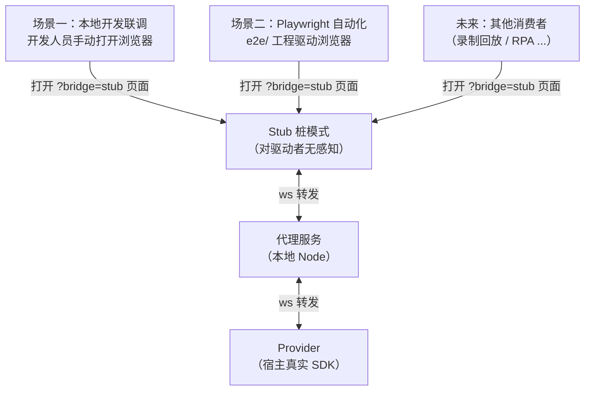

# Linkx Dev Bridge — SDK 代理桥

> **工具无关的本地联调基础设施**：让本地浏览器（开发联调时由开发人员手动打开，自动化测试时由 Playwright 等工具驱动）共享宿主 App 内的真实 SDK。
>
> 桥对"谁在驱动浏览器"无感知 —— 本地联调与自动化测试使用**同一套桩模式入口（`?bridge=stub`）**，Playwright 只是桥的消费者之一（见 `e2e/`）。
>
> 当前已接入端：**H5Portal、web-bspc、web-cspc**。三端共用 relay 协议，分别保留各自 SDK 的传输和事件适配。
> 方案原理与完整使用手册：[前端自动化测试使用指南](../docs/前端自动化测试使用指南.md)。

## 一、两个使用场景



| 场景 | 驱动者 | 说明 |
|------|--------|------|
| 本地开发联调 | 开发人员 | 浏览器打开 `/?bridge=stub`，本地页面获得宿主真实 SDK：改代码热更新即时生效，不必反复让宿主重载 |
| Playwright 自动化 | e2e/ 工程 | 用例以同一 stub 模式驱动页面，验证真实 SDK 链路 |

## 二、目录结构

```
dev-bridge/
├── proxy-server/server.js        # 代理服务（WS 中转 + HTTP 健康检查 + provider 状态广播）
├── page-scripts/                  # 协议主干（工具无关）
│   ├── provider-core.js           #   createProvider(config)
│   ├── stub-core.js               #   createSdkStub(config)
│   └── env-spoofs.js              #   环境伪造钩子（chrome.webview 等）
├── h5portal/                      # H5Portal 端适配层（flutterNativeBridge）
│   ├── provider.js / stub.js
│   ├── bridge-events.js           #   事件桥清单
│   └── stub-config.js             #   事件白名单 + 环境伪造
├── web-bspc/                      # BSPC（SETUP_CHANNEL + MessagePort）
├── web-cspc/                      # CSPC（chrome.webview + WebView2 环境）
├── package.json                   # 独立包（ws + proxy 启动脚本）
└── README.md
```

## 三、快速开始（本地联调）

```powershell
# ① 安装依赖（仅首次）
cd dev-bridge; pnpm install

# ② 选择一个目标启动代理（终端1）
pnpm run proxy:h5portal       # H5:   WS 8787 / 健康检查 8788
pnpm run proxy:web-bspc       # BSPC: WS 8887 / 健康检查 8888
pnpm run proxy:web-cspc       # CSPC: WS 8987 / 健康检查 8988

# ③ 启动前端 dev（终端2）
cd ../H5Portal; pnpm dev     # http://localhost:8001

# ④ 宿主 App 配置业务 URL（provider 模式）
#    H5Portal 宿主: http://<本机IP>:8001/linkx/h5portal/?bridge=provider
#    BSPC 宿主:     https://<本机IP>:3100/?bridge=provider
#    CSPC 宿主:     https://<本机IP>:3100/?bridge=provider&clientType=CSPC
#    宿主控制台出现 provider connected 即就绪

# ⑤ 开发者本地浏览器打开对应桩模式页面（联调入口）
#    H5:   http://localhost:8001/linkx/h5portal/?bridge=stub
#    BSPC: https://localhost:3100/?bridge=stub
#    CSPC: https://localhost:3100/?bridge=stub&clientType=CSPC
#    （可再加 &debug=true 开启 vConsole）
```

联调价值：
- **本地页面 + 真实 SDK**：页面在本地浏览器完整可用（登录态、取数、原生弹窗均走宿主真实链路）
- **热更新**：改代码 Vite 即时生效，不用宿主反复重载页面
- **多窗并行**：代理广播事件，可同时开多个 stub 页面（如普通窗口 + vConsole 调试窗口）

## 四、调试方法

### 控制台调试入口

宿主 App 的 WebView 控制台（provider 侧）：

```javascript
window.__bridgeProvider.status()    // {connected: true, hasSDK: true}
window.__bridgeProvider.reconnect() // 强制重连代理
```

本地浏览器控制台（stub 侧）：

```javascript
window.__bridgeStub.status()         // {connected, providerOnline, pending, events, storageKeys}
window.__bridgeStub.ready()          // 桩是否已连上代理

// 手动调一次 SDK 验证链路（桩锁定全局变量）
await window.WeSpaceSDK.getUserInfo()
```

### 验证桩是否生效

```javascript
// 桩是 Proxy：调用不存在的方法应返回 Promise 而不抛错
const r = window.WeSpaceSDK.__nonExistentTest__()
console.log(typeof r?.then === 'function')   // true 即桩生效
```

### 健康检查

```powershell
curl http://localhost:8788
# 返回 {"ok":true,"providerConnected":true,...} 即宿主已连上
```

## 五、端口约定

| 用途 | 端口 |
|------|------|
| H5Portal dev server | 8001（http） |
| web dev server | 3100（https） |
| H5 relay WS / HTTP | 8787 / 8788 |
| BSPC relay WS / HTTP | 8887 / 8888 |
| CSPC relay WS / HTTP | 8987 / 8988 |

> 支持 `BRIDGE_WS_PORT` / `BRIDGE_HTTP_PORT` 环境变量覆盖。多目标并行时建议保持默认端口段，或为每个目标配置独立端口。

## 六、常见问题

| 现象 | 原因 | 解决 |
|------|------|------|
| `provider not connected` | 宿主没连上代理 | 检查宿主控制台 `[bridge provider] connected` 日志；curl 健康检查端口确认 `providerConnected` |
| `provider not connected (waited Ns)` | 等待窗口内宿主端 provider 始终未连接代理 | 确认宿主已加载 dev 页面且 URL **不带** `bridge=stub`（带了宿主自己会变成桩） |
| 调用挂起/延迟生效（宿主后开） | **门控机制（正常行为）**：代理推送 provider 在线状态，宿主未上线时调用静默等待不报错（h5portal 端窗口 1.5s） | 窗口内宿主连上即自动放行；`window.__bridgeStub.status()` 的 `providerOnline` 可查实时状态 |
| `proxy timeout: getUserInfo` | 真实 SDK 调用超时 | 检查宿主网络/SDK 就绪状态 |
| `WeSpaceSDK not ready` | SDK 未注入 | 确认 App.vue 已执行 `window.WeSpaceSDK = WeSpaceSDK` |
| 页面白屏 | stub 没加载 | 确认 URL 带 `?bridge=stub` 且处于 dev 模式 |
| 宿主重载后 stub 页无响应 | provider 短暂断开 | 自动重连机制会恢复；必要时 `window.__bridgeStub.status()` 查看，或刷新 stub 页 |
| 生产包带桥代码 | DEV 判断失效 | 生产 build 时 `import.meta.env.DEV` 为 false，整段 tree-shake；产物 grep `__bridge` 验证 |

## 七、供自动化工具集成（Playwright 示例）

桥不依赖任何自动化工具；自动化工具通过以下方式消费桥：

1. **webServer 拉起代理**：playwright.config 的 webServer 执行 `node <dev-bridge>/proxy-server/server.js`（可用 `BRIDGE_WS_PORT`/`BRIDGE_HTTP_PORT` 指定端口）
2. **以 stub 模式打开页面**：与本地联调完全相同的 `?bridge=stub`
3. **健康检查降级**：宿主离线时用例自动 skip

现成消费者工程见 [e2e/README.md](../e2e/README.md)。

## 八、新端接入指南（四步）

1. **建适配目录**：`dev-bridge/<新端>/`（provider.js / stub.js / bridge-events.js）
2. **写端配置**：确定 SDK 定位与桩安装方式（全局变量型 → 默认 defineProperty 锁定；模块单例型 → 覆写 `installStub`/`getSDK`）、事件白名单、环境伪造、端口（错开端口段）
3. **业务仓库接入**：vite 增加 `'@dev-bridge'` alias 与 `server.fs.allow`（放行仓库根）；main 入口顶部静态 import `stub.js`、DEV 分支动态 import `provider.js`
4. **（可选）接入自动化**：在 `e2e/<新端>/` 建 config/fixture/用例

> 三端当前都已接入。新增目标时参考本节和 `e2e/` 的 target/config/fixture 约定；不要修改宿主提供的原始 SDK 文件。
