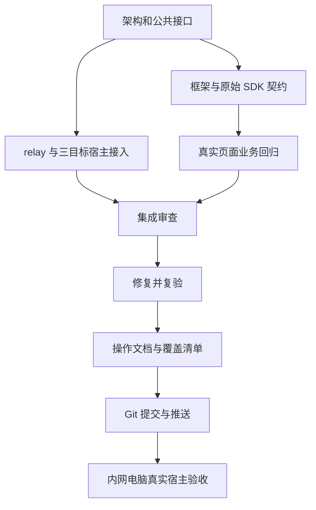

# 前端自动化实施计划

## 目标和约束

采用 C 方案：`e2e` 为独立 Playwright 工程，`dev-bridge` 负责内网真实宿主联调。目标拆为 `h5portal`、`web-bspc`、`web-cspc`。web 的业务代码共享，但 SDK 协议、初始化、事件和参数适配分别验证。

- 不修改宿主提供的 WeSpaceSDK 文件及接口。
- offline 使用真实前端和原始 SDK，模拟 SDK 下方的宿主通信及业务网络。
- live 使用真实宿主 SDK 和内网业务接口，不能用 offline 成功代替 live 成功。
- 浏览器页面、宿主调用、宿主事件和原生组件呈现分别记录证据。
- 当前电脑无法访问内网，真实宿主操作须在内网电脑验收。
- 每次交付列出已覆盖和未覆盖业务，不能宣称现有全部业务已经覆盖。

## 任务分工

| 负责人 | 思考强度 | 文件范围 | 交付物 |
| --- | --- | --- | --- |
| 框架 agent，6.1 Sol | medium | e2e 配置、fixture、host transport、SDK contracts | 三目标两模式框架、生命周期、原始 SDK 契约验证 |
| 桥接 agent，6.1 Sol | high | dev-bridge、H5/web 开发态接入 | 会话 relay、Provider/Stub、事件与多参数转发、同源代理 |
| 业务 agent，6.1 Sol | high | e2e 业务 scenarios、页面操作、业务 specs、同名 spec.md | 实际页面业务回归、宿主差异断言、覆盖清单 |
| 主 agent | 集成与审查 | docs、测试 skills、跨模块协调 | 逐轮 code review、集成验证、使用指南、Git 提交和推送 |

## 依赖关系

## 分阶段执行和验收

### P0：基线和接口约定

状态：已完成。

1. 记录工作区原有变更、分支和远端，不覆盖用户工作。
2. 固定三目标名称及 offline/live 语义。
3. 固定 fixture、scenario、调用证据、桥接会话及 readiness 接口。
4. 明确共享和独占文件，避免 agent 同时修改同一文件。

验收：各 agent 使用相同目标和配置，接口有具体代码定义。

### P1：框架与宿主契约

状态：已完成。

1. H5 flutterNativeBridge、BSPC MessagePort、CSPC WebView2/PIM 平台识别模拟。
2. SDK 请求与响应关联、事件编码、storage 编码、多参数、错误与超时。
3. 按 browser context 隔离状态；调用等待消费游标及过期清理。
4. 配置目标、模式、前端地址、服务启动及报告。
5. 通过原始 SDK harness 验证三种通信协议。

验收：三目标 SDK 契约实际运行；不存在历史调用误匹配或跨用例污染。

### P2：真实宿主桥接

状态：已完成。

1. Provider/Stub 显式启用；会话和目标独立路由。
2. 原 SDK 多参数转发、业务监听保留、远端订阅和事件回传。
3. Provider 就绪、SDK 就绪、页面就绪独立判断。
4. 断开、超时、旧连接关闭、重连处理；不可序列化参数/结果明确报错。
5. H5/web 开发态接入、HTTPS/WSS 同源代理。

验收：relay 回归通过，缺少真实 Provider 时 live 明确失败；原 SDK 文件无变更。

### P3：实际页面业务流程

状态：已完成当前代表性流程；后续业务按覆盖矩阵持续增加。

1. 源码确认创建协同群的 API、权限、通知事件及后续宿主调用。
2. H5：标签选择、创建请求、群 ID 匹配事件、宿主后续操作。
3. web：实际创建群页面或弹窗，分别断言 BSPC/CSPC 后续调用。
4. 成功、接口拒绝、取消、权限不足、错误事件等适用分支。
5. 同名 spec.md、业务覆盖清单和原生组件人工步骤。

验收：真实前端可操作；断言请求参数、业务结果、SDK 调用和事件后的行为，不能只有 body visible。

### P4：逐轮审查和复验

状态：已完成。

1. 第一轮：架构和协议，目标判断、事件格式、多参数、配置一致性。
2. 第二轮：异常和生命周期，超时、断线、竞争、隔离、资源清理。
3. 第三轮：实际运行、生产影响、报告和文档一致性。
4. 问题回交对应 agent，修复后再次检查。
5. 执行类型检查、SDK contracts、relay 回归、实际页面 offline 用例及相关构建检查。

验收：报告给出实际通过/失败/跳过数量；无法运行的内网项目不标为已通过。

### P5：文档和技能

状态：已完成。

1. 新电脑安装、锁文件、浏览器依赖和启动顺序。
2. offline 使用、数据修改、调试、报告查看。
3. 内网 Provider 与本地 Stub 连接；模拟器访问主机地址及端口。
4. BSPC 与 CSPC 差异，HTTPS/WSS，测试会话与串行运行。
5. 新需求补用例、测试数据清理、失败排查及人工原生确认。
6. 两个现有测试 skill 增加 Playwright 分流，保留 Vitest 用途；路径可迁移。
7. 旧 linkx-e2e 的迁移关系与不再并行维护的说明。

验收：命令对应实际 package scripts；复制到另一台电脑不依赖当前绝对路径。

### P6：Git 交付和内网验收

状态：代码与文档已完成，待本次 Git 提交和推送。

1. 检查完整差异，避免提交 node_modules、凭证、报告及无关文件。
2. 生成提交，推送 Git 远端，报告提交号和推送结果。
3. 内网验收按使用指南操作，记录宿主版本、SDK、目标、环境和运行证据。
4. 原生弹窗、宿主导航、真实用户选人及真实后端数据一致性单独确认。

完成标准：可重复运行的框架、已验证代表性业务、诚实覆盖清单、配套指南和已推送代码。内网宿主是否适用，以真实环境验收为准。
