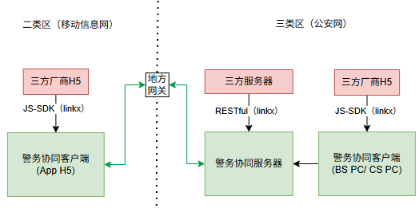
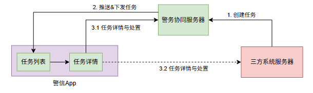
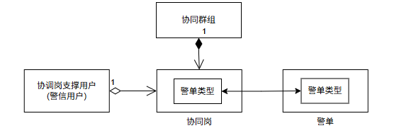
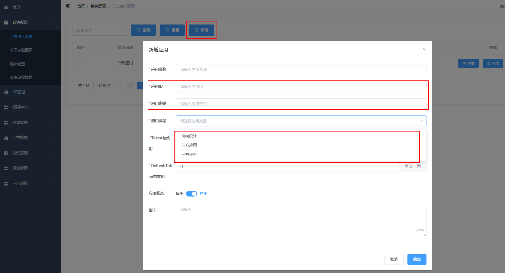
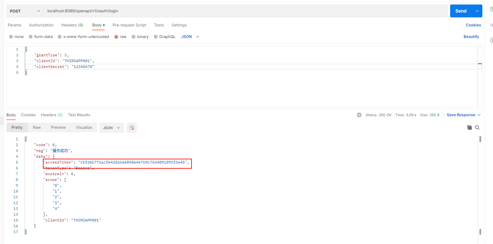
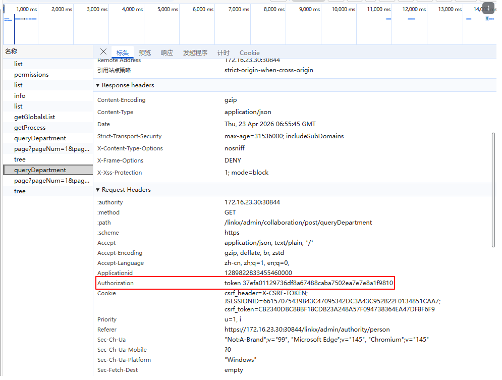
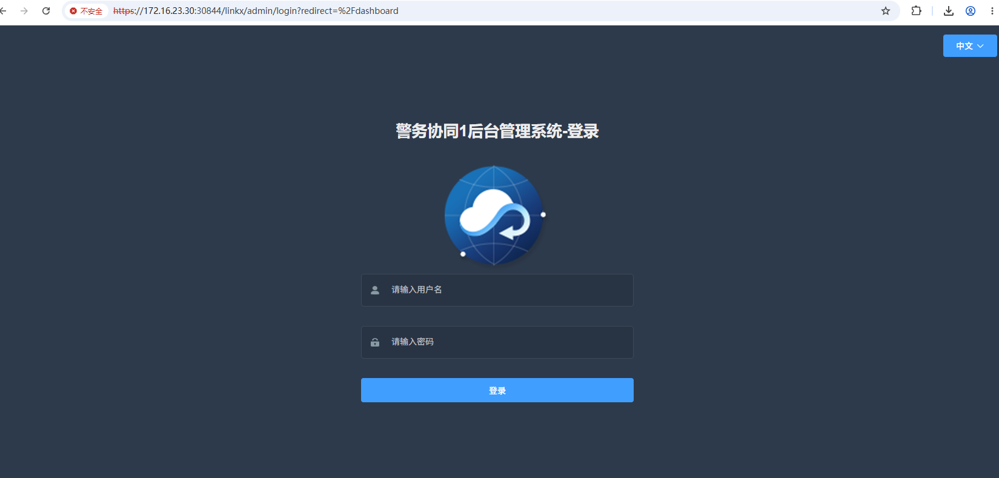
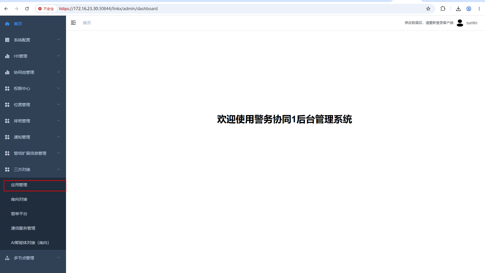
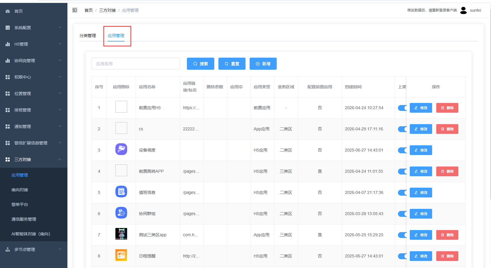
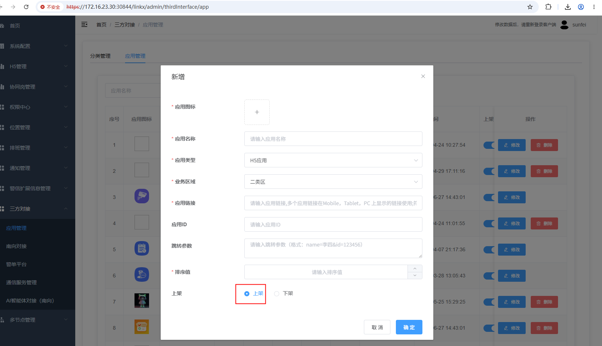

**警务协同开放接口文档-开发指南**

# 1 警务协同介绍

警务协同又称Linkx，主要定位于如下业务场景：

1. 构建多警种随时通信与多应用服务随时调用的业务服务体系，满足跨警种、跨系统的即时协作需求。

1. 汇聚各类业务数据和各类警务资源，统一整合入口和协同手段。

## 1.1 对接组网

警务协同开放接口能力提供如下组网和对接方式，主要覆盖客户端“常用应用”对接和服务器的“系统级对接”两大业务场景：

注意：三方系统需要自己解决公安网内部网络边界的问题。

## 1.2 任务标准件

统一任务中心作为全域信息汇聚入口，提供标准化接口能力，接入各类第三方业务系统，将分散的通知、事务、待办等以任务形式统一归集至移动端任务列表集中展示。实现消息一处接收、待办统一展示，用户无需切换多系统，可随时随地查看个人需处置的各类警务事务。

任务标准件会提供创建、处置、更新接口，警信App侧可以查看任务列表和详情。如果三方系统能够提供详情URL，则可以跳转至三方流转处理，如果不提供，则警务系统自己提供任务流转和处理页面。

## 1.3 一键建群

面向移动端H5提供一键建群接口，H5在处置业务过程中，如果需要协同研判，可调用一键建群接口建立协同群组（建群规则由后台运维人员配置，可以拉入协同岗和相关领导）。

## 1.4 警单建群（可选）

系统提供通过警单建群的能力，三方系统可传入警单号来创建群组或获取关联的群组列表。

若需对接警单与协同岗、协同群组的关联能力，需在警务协同平台管理后台配置警单接口，完成警单数据获取。

关联算法：客户的“警单类型”需要与警务协同的“协同岗”的“警单类型”需要保持一致，这样就可以通过警单类型拉取对应协同岗创建协同群组，创建成功以后，协同群组将会和警单进行关联关系绑定。 

# 2 开放接口能力

## 2.1 业务能力

通过本开放接口，三方平台可以实现如下业务场景：

1. 统计数据获取；

1. 提供了一些App端侧的本地资源交互接口（部分接口带UI）；

1. [可选]警务协同如果对接了警单系统，则可以完成警单与协同岗、协同群组之间的快捷交互；

## 2.2 接口能力

本开放接口提供了两套接口能力：

1. 系统级的RESTful：

1. 登录、登出

1. 获取警信用户列表、警信用户详情；

1. 获取协同岗列表，协同岗支撑人员列表；

1. 统计数据获取；

1. [可选]获取协同群组和警单的关联关系，支持通过警单一键建群；

1. 用户级的JS-SDK：

1. 统一登录，并获取我的基本信息；

1. 本地资源交互：从相册选择资源、从相机获取资源、缓存数据设置与读取、状态栏信息获取、GIS信息获取；

1. 打开应用；

1. 通知栏消息推送；

1. 警信消息发送（卡片消息）；

1. 协同业务：获取协同岗及支撑人员列表、获取一键建群类型以及一键建群；

1. UI组件：建群、发送卡片消息、选择警信聊天会话、选择用户组件等；

# 3 开通授权

## 3.1 密钥获取

联系警务协同管理员，完成三方应用注册，并获取应用ID和应用密钥。

管理员操作：

进入后台管理系统，系统配置->三方接入管理，新增应用并启用。

## 3.2 警单对接

1. 在警务协同管理后台“三方对接”->"警单平台"->"类型管理"中创建警单类型；

1. 在警务协同管理后台“协同岗管理”->"协同岗管理"中创建或修改协同岗的属性，关联相关的警单类型；

1. 有了上述配置以后，三方警单同步过来以后，如果触发了一键建群，则会按照上述关联关系去创建群组，并将群组和警单关联；

  

# 4 接口对接

目前支持RESTful方式进行服务器接口对接，先联系警务协同团队获得警务协同服务地址，以下用{serverUrl}表示，然后按以下步骤对接：

1. 调用https://{serverUrl}/openapi/v1/oauth/login, 获得accessToken

2. 按照业务接口按需调用，所有的接口请求头需要携带参数："Authorization=token xxxx"

# 5 三方应用入驻

系统支持入驻H5应用、Android原生应用、鸿蒙原生应用。但是涉及警信接口交互的目前仅支持H5应用对接。

1.若需要在警务协同中获取三方应用信息，则需要三方应用接入Linkx-sdk

请参考JS-SDK开放接口文档，“引入方式”一章

注意：

  Linkx-sdk.js文件会随Linkx-sdk说明书做统一配套。

2.配置三方应用到警务协同

操作路径：后台系统 -- 三方对接 -- h5管理-应用管理

以为例：

1、打开警务协同后台系统，填入用户名、密码。登录

2.左侧菜单展开三方对接，点击应用管理

3.切换到应用管理的标签页

4.点击新增，在弹窗里填入应用相关的参数。上架字段选择“上架”，如果选择“下架”，会导致常用应用中看不到该新增应用。

注意：涉及警信接口交互的目前仅支持H5应用对接，所以应用类型必须选择H5应用

5.完成填写，点击确定。之后登录警信，警务协同页，点击常用应用，可以看到刚刚新增的应用了。

注意：

  已经登录了警信app的账户：需要在常用应用页，下滑刷新，或者重新登录。即可看到新增应用